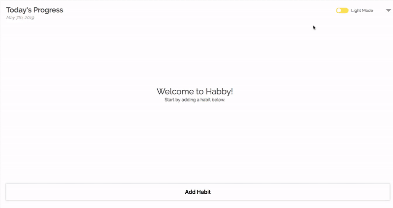
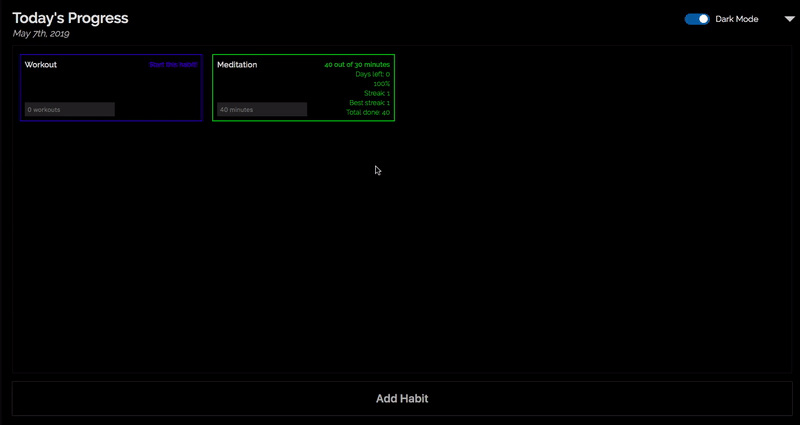
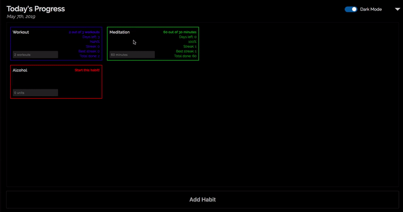
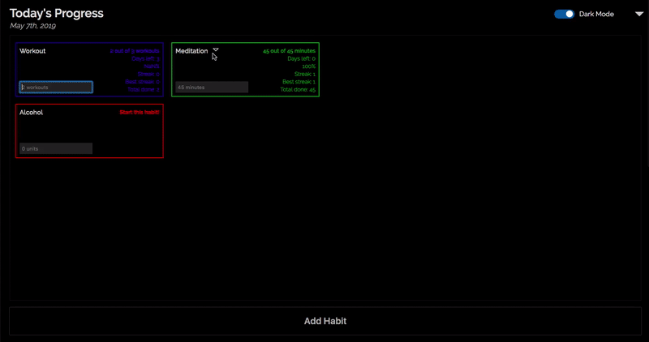
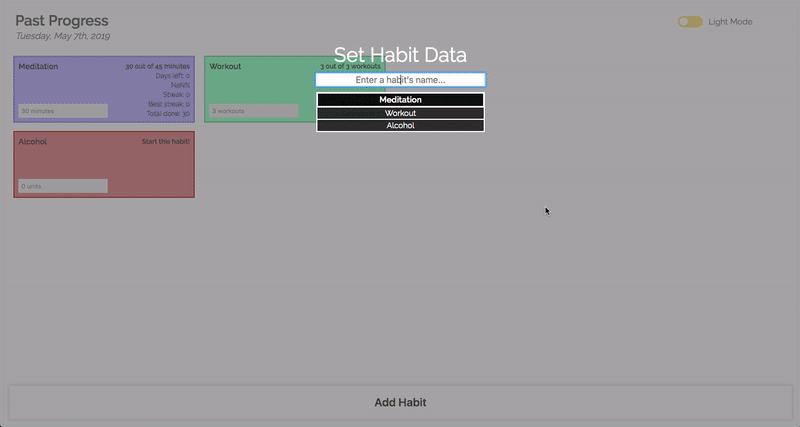
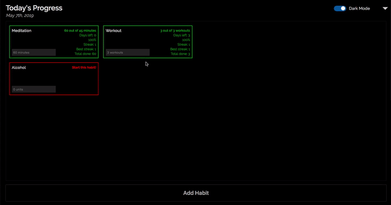

# Stay Habby

A habit tracker app, originally started by [Arie Milner](https://github.com/amilner42/habby) (Nov—Dec 2017) and currently only further developed by me (Dec 2017—present).

Much more flexible, user-friendly, and effective than any other habit tracker we've tried... but that's just my opinion ;)

---

## Features

### Light Mode / Dark Mode / Add a Habit

This is where you start your journey!

### Habits Automatically Sorted

Your habits will be automatically sorted by urgency, completion, and progress in the current time fragment. This should hopefully help give you an idea of which habits you should prioritize, but it is by no means a dictation.

### Edit a Habit's Goal

Sometimes your goals change. You can update a habit's goal, and don't worry, your previous goals will still be taken into account when calculating your overall success percentage.

### Suspend and Resume Habits

Sometimes your priorities change. You can suspend and resume habits as you wish. When a habit is suspended, your performance on it will not impact your success percentage. You can still enter data for the habit if you want to track it.

### Keyboard Shortcuts

The modern habit-tracking human is too efficient to use a mouse. Every single feature in Stay Habby, from toggling dark mode to graphing habits, has a simple keyboard shortcut. You can also press `/` to view the available shortcuts on any page.

### Track your Journey with Notes

Inspired by Cal Newport's [Deep Work](http://calnewport.com/books/deep-work/).

Tracking "lead" measures (e.g. how many times this week you worked out) is more useful for long-term progress than tracking "lag" measures (e.g. how many PR's you hit in your workouts this week), because you have much more control over lead measures. This is the idea behind Habby: day-to-day actions are important and under your control.

But it's still quite useful to track lag measures, especially alongside your lead measure tracking. This can give you an idea of, for example, how many workouts it takes you to hit a personal record.

Note down a lag measure, or even just a diary entry, by adding a Note to a habit for the day.

### Graphs

Here you can view a habit's progress over time, including any Notes you've added for the habit, failed goal intervals, successful goal intervals, and periods during which the habit was suspended.

---

Keep Calm and Stay Habby!
